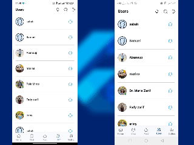

# social app

This is Social Media App built with Flutter and Firebase with bloc state management. The app provides users with a clean and intuitive UI/UX and offers chat, dynamic links, adding new posts or stories, and much more.
To download this app, follow this link: [social app](https://www.dropbox.com/scl/fi/10d82yu908r0gbbv2c626/social-app.apk?rlkey=ibqyxnbx5aqzbxk4cxmwrpowz&st=q0dmzbs9&dl=0)

## Features:
1. Authentication & User Profile
The app uses Firebase Authentication to allow users to create an account, log in. Users can log in using their email and password , Once logged in, users can view and edit their profile, including their name, profile picture, bio and add thier photos. They can also view their activity log and followers/following list.

  

2. Messaging
Users can start a new conversation and they can also view their message history, Shows who you are talking to online or offline (If the application is open, they are online), If you are inside the application but not on the conversation page, a notification is sent inside the application from the top, and when you click on it, you are transferred to the conversation page in which the message was sentو If you are outside the application, a notification is displayed from the system interface.

  

https://github.com/user-attachments/assets/64a3250a-d3f2-40a1-999c-6736fde2126f

4. Add and View Story
You can view the Story of your friends and you can create more than one Stories of your own and all Stories of all users are automatically hidden after 24 hours.

  

4. Create Post
Post photo posts from camera or gallery with description.

  

5. Edit or delete Post
Can edit post'photo or description or delete it.

  

6. Show feeds and make like and comment
View posts from friends and Engage with posts by commenting and liking content.

  

7. Search for user or post and You can enter any personal page of the post creator

  

